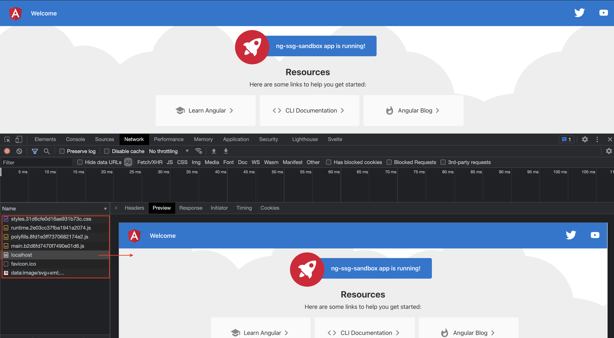
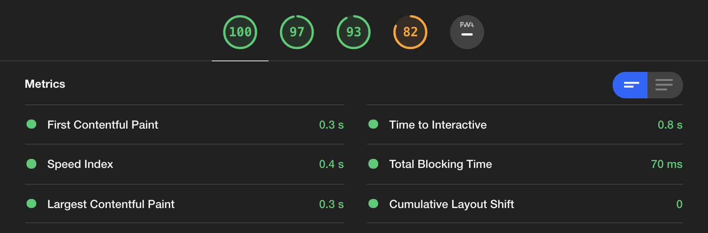

# Angular SSG Scully.io sandbox project

This project was generated with [Angular CLI](https://github.com/angular/angular-cli) version 12.1.3.

[Scully.io](https://scully.io/) - SSG for Angular

## Build static site

Run `npm run build:ssg` to generate static files. The build artifacts will be stored in the `dist/static` directory.

## Serve with Nginx

Copy Nginx config `ng-ssg-sandbox.nginx.conf` into `servers` directory of Nginx. Run Nginx and open `localhost:8082`

Best Lighthouse metrics!

